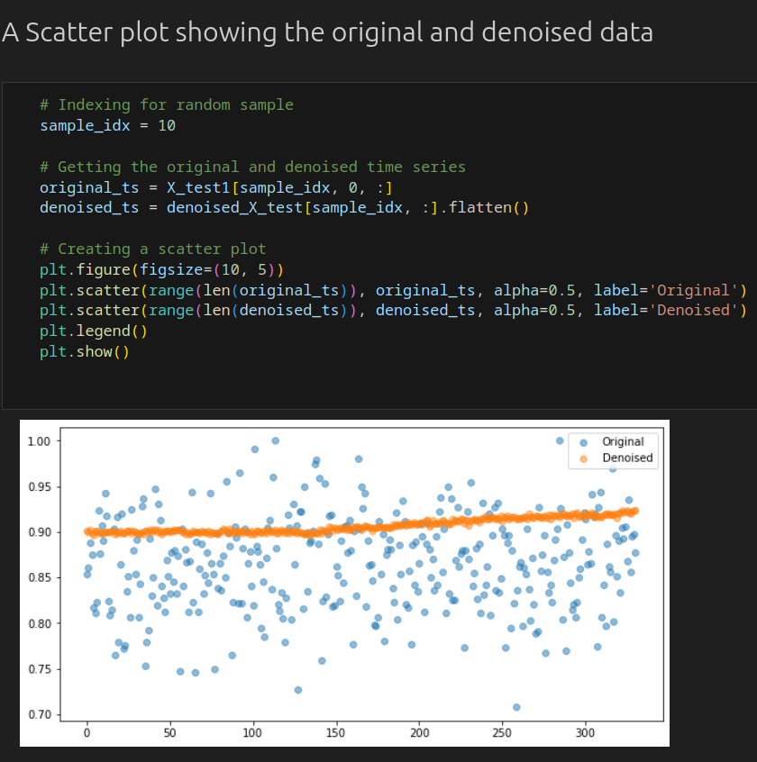

# Long Short-Term Memory (LSTM) model to denoise time series data

The project revolves around the implementation of a Long Short-Term Memory (LSTM) model within an autoencoder framework to effectively denoise time series data.

## Demostration

## Process

The choice of LSTM is rooted in its adeptness at capturing temporal patterns and addressing gradient vanishing issues often encountered in conventional recurrent neural networks (RNN).

This model's capacity to comprehend sequences with enduring dependencies renders it particularly well-suited for applications like time series forecasting.

## Training Processing

The training process spans 10 epochs, culminating in a commendable loss of 0.00170 and a validation loss of 0.000824.
Notably, the resulting Mean Squared Error (MSE) of 0.0029 indicates a high fidelity between the denoised and original data, underscoring the autoencoder's efficacy in noise removal.
Moreover, the rapid convergence of training loss highlights the model's exceptional performance. The visual representation of original and denoised data substantiates the noise reduction achieved.

### Conclusion

The LSTM-powered autoencoder excels in mitigating noise from time series data, benefiting from its temporal modeling capabilities and demonstrating consistent and impressive results.
